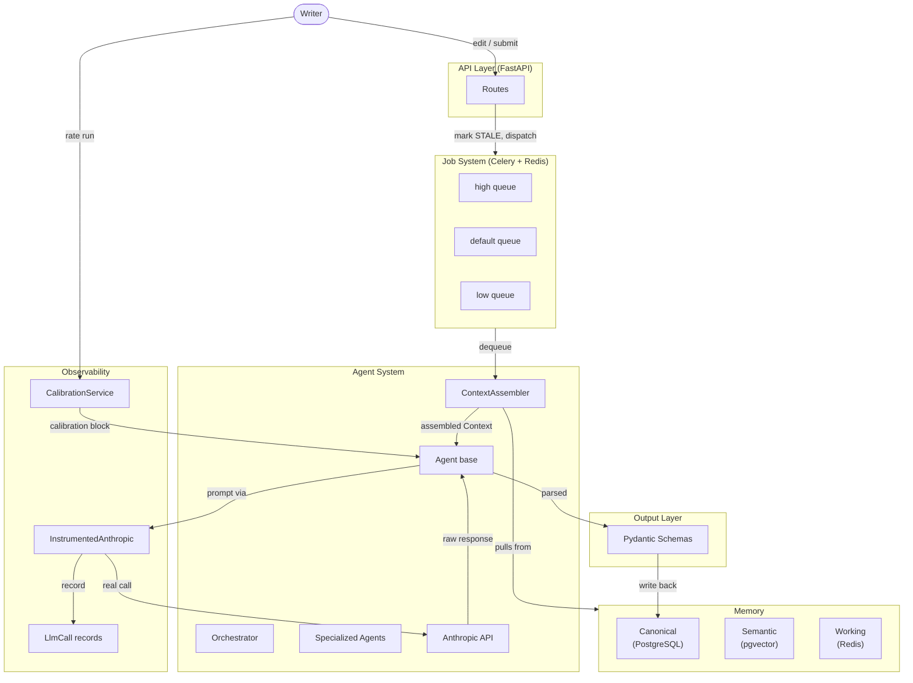

# Loreboard — Agentic System Architecture

> Canonical reference for backend architecture. Update this file when changing memory layers, job system, DB schema, API endpoints, or telemetry.

---

## High-Level Architecture



---

## 1. Memory Layers

Three layers at different speeds and scopes:

| Layer | Backing Store | Scope | TTL |
|---|---|---|---|
| **Canonical** | PostgreSQL | Persistent story truth | Forever |
| **Semantic** | pgvector (on entities) | Similarity search | Forever |
| **Working** | Redis | Per-job ephemeral context | 1 hour (configurable) |

### Canonical (`memory/canonical.py`)
The authoritative record of what the writer has explicitly written. All persistent reads/writes go here. Key behaviours:
- `upsert_chapter_content()` automatically marks the chapter `STALE` — any edit invalidates prior analysis.
- `mark_chapter_analyzed()` flips state to `ANALYZED` only after an agent successfully completes.
- All entity merging is additive: `upsert_entity()` deep-merges attributes rather than overwriting.

### Semantic (`memory/semantic.py`)
pgvector cosine similarity over entity embeddings (dim=1536). Uses an `EmbeddingProvider` protocol — swap any embedding backend without touching agent code.
- Vector format must be `"[x,y,z]"` string (no spaces). Use `"[" + ",".join(str(x) for x in vec) + "]"`.

### Working (`memory/working.py`)
Redis-backed key/value store namespaced by `job_id`. Agents write intermediate results here so downstream agents in the same job chain can read them. Falls back to in-process dict if Redis is unreachable (logged, not silently).

---

## 2. Context Assembly (`context/assembler.py`)

```
ContextAssembler.assemble(agent_type, task_description, scope) → Context
```

`TaskScope` pins the context to a story, chapter, entity, or global view. The assembler pulls from all three memory layers — but the depth of each pull is gated by `agent_type`:

| Agent | Chapters pulled | Entities pre-loaded | Semantic search |
|---|---|---|---|
| `orchestrator` | All (overview) | Yes | No |
| `chapter_analyzer` | Scoped chapter | Yes | Yes |
| `entity_extractor` | Scoped chapter | **No** (avoids anchoring) | Yes |
| `consistency_checker` | All | Yes | Yes |
| `autofill` | Scoped chapter | Yes | Yes (on placeholder) |
| `summarizer` | All | Yes | No |

`Context.to_prompt_dict()` serialises the assembled context into a dict safe to inject into any prompt.

---

## 3. Agent System

See `docs/agents.md` for the full agent reference. Summary:

- All agents subclass `Agent` from `agents/base.py`.
- `Agent.__init__` creates an `InstrumentedAnthropic` client (not raw `AsyncAnthropic`).
- `Agent.run()` creates an `AgentRun` record, sets the run_id on the client, calls `_execute()`, then persists output/status.
- Output schemas are Pydantic v2 subclasses of `AgentOutput` in `output/schemas.py`.

### Agent Status

| Agent | File | Status |
|---|---|---|
| `OrchestratorAgent` | `agents/orchestrator.py` | Implemented |
| `ChapterAnalyzerAgent` | _to be added_ | Stub |
| `EntityExtractorAgent` | _to be added_ | Stub |
| `ConsistencyCheckerAgent` | _to be added_ | Stub |
| `AutofillAgent` | _to be added_ | Stub |
| `SummarizerAgent` | _to be added_ | Stub |

---

## 4. Job System (`jobs/`)

### Queues

| Queue | Priority | Used for |
|---|---|---|
| `high` | 10 | Orchestration, autofill (latency-sensitive) |
| `default` | 5 | Analysis, entity extraction, consistency |
| `low` | 1 | Background summarisation, batch reanalysis |

`task_acks_late=True` — tasks acknowledged only after completion, so crashes don't silently drop work.
`worker_prefetch_multiplier=1` — one task per worker, preventing long jobs from blocking the queue.

### Job Lifecycle (`jobs/helpers.py`)
```
PENDING → RUNNING → DONE
                 ↘ FAILED
```
`run_job(job_id, coro_fn)` handles the full lifecycle. Celery tasks call `self.retry(exc=exc)` on failure for up to 3 retries with 10s backoff.

### Staleness
```
Chapter edited   → analysis_state = STALE
Chapter analyzed → analysis_state = ANALYZED
```
The orchestrator queries `get_stale_chapters()` to re-dispatch only what's out of date.

---

## 5. Canonical State Model

### Table Hierarchy
```
stories
  └── chapters          (ordered, content, analysis_state)
       ├── entity_mentions (position, snippet)
       ├── story_flags     (type, severity, resolved)
       └── chapter_overrides (key/value, writer-set)
  └── entities           (type, attributes, embedding vector)
  └── job_records        (type, status, priority, result)
       └── agent_runs    (input, output, tokens, elapsed)
            ├── llm_calls     (per-call: model, tokens, latency, tool_calls, I/O)
            └── feedback_entries (rating, calibration_data)
```

### AnalysisState Machine
```
PENDING  ─── chapter created
ANALYZED ─── agent run completed successfully
STALE    ─── chapter content edited after last analysis
```

### Flags & Overrides
- **Flags** (`StoryFlag`): agent-generated issues. Severity: `info | warning | error`. Resolved by writer.
- **Overrides** (`ChapterOverride`): writer-set key/value pairs injected into context (e.g. `"pov": "unreliable narrator"`).

---

## 6. Telemetry (3 Layers)

### Layer 1 — Instrumentation (`telemetry/collector.py`)
`InstrumentedAnthropic` wraps `AsyncAnthropic`. Every `messages.create()` call:
1. Measures wall-clock latency.
2. Captures input messages (system + messages array), output content blocks, tool calls, token counts.
3. Fires `asyncio.create_task(_persist_call(...))` — non-blocking, errors are logged not raised.

`Agent.run()` calls `self._client.set_run_id(run_id)` before `_execute()` and clears it in `finally`.

### Layer 2 — Collection (`db/models.py` → `LlmCall`, `telemetry/service.py`)
`LlmCall` table fields: `run_id`, `model`, `input_tokens`, `output_tokens`, `latency_ms`, `stop_reason`, `tool_calls` (JSONB), `input_messages` (JSONB), `output_content` (JSONB).

`TelemetryService` methods:
- `list_runs(agent_type, limit, offset)` — paginated run list with llm_call_count
- `get_run_detail(run_id)` — full run with all `LlmCall` records
- `get_summary(since_hours)` — aggregate stats per agent type (tokens, latency, error rate)

### Layer 3 — Display (`frontend/src/pages/Telemetry.tsx`)
Available at `/telemetry`. Shows:
- Stats cards (total runs, total tokens, errors, error rate) with time window selector
- Per-agent breakdown table
- Recent runs list — expandable rows showing LLM calls with full input/output/tool call detail

### structlog Tracing (`telemetry/tracer.py`)
Context variables `trace_id`, `job_id`, `agent_type` threaded through async stacks via `ContextVar`.
Decorators: `@trace_agent("type")` for agent methods, `@trace_job` for Celery tasks.

---

## 7. Feedback & Calibration (`feedback/calibration.py`)

Writers rate any agent run (1–5) with optional notes and structured `calibration_data`.

`CalibrationService.get_calibration_context(agent_type)` → `CalibrationContext`:
- Average rating
- Patterns from low-rated runs (injected as "avoid these")
- Writer-specified overrides

`force_calibration(run_id)` resets the applied flag so the agent re-processes feedback on next run.

---

## 8. API Layer (`api/`)

FastAPI with prefix `/api/v1`. All job submission endpoints return `202 Accepted` with `job_id`. Clients poll `GET /jobs/{id}` for status.

| Resource | Endpoints |
|---|---|
| Stories | `POST /stories`, `GET /stories/{id}` |
| Chapters | `POST /chapters`, `PATCH /chapters/{id}/content`, `POST/GET /chapters/{id}/overrides` |
| Jobs | `POST /jobs/orchestrate`, `POST /jobs/analyze-chapter/{id}`, `POST /jobs/extract-entities/{id}`, `POST /jobs/check-consistency/{id}`, `GET /jobs/{id}`, `GET /jobs/story/{id}` |
| Flags | `GET /stories/{id}/flags`, `PATCH /flags/{id}/resolve` |
| Feedback | `POST /feedback`, `POST /feedback/force-calibration/{run_id}`, `GET /feedback/calibration/{agent_type}` |
| Telemetry | `GET /telemetry/runs`, `GET /telemetry/runs/{id}`, `GET /telemetry/summary` |

Request/response schemas live in `api/schemas.py`, separate from route logic.

---

## 9. Running Locally

```bash
# Infrastructure
cd backend && docker compose up -d

# Dependencies
pip install -r requirements.txt

# DB migrations
alembic revision --autogenerate -m "initial"
alembic upgrade head

# API server
uvicorn src.main:app --reload

# Celery workers (separate terminal)
celery -A src.jobs.worker.celery_app worker --queues=high,default -l info

# Frontend
cd frontend && npm run dev   # → http://localhost:3000
```
