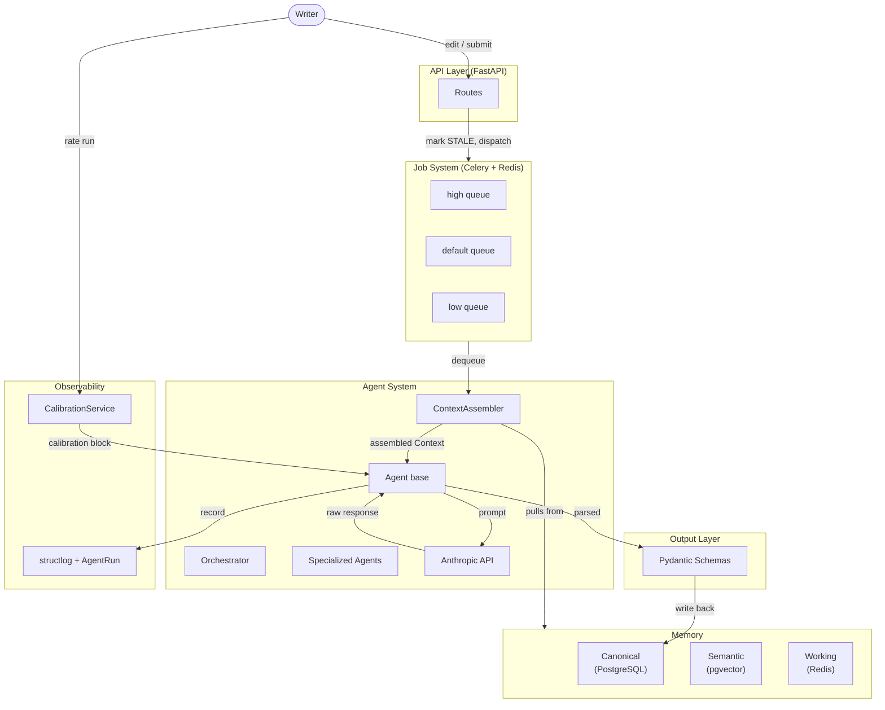

# Loreboard — Agentic System Architecture

## Overview

Loreboard is a creative writing assistant built on a custom agentic backend. Rather than a simple prompt-in/response-out pipeline, it models the story as live **canonical state** that agents continuously analyze, annotate, and flag. Writers receive structured analysis (entity tracking, consistency checks, autofill suggestions) while retaining full authorial control via overrides and a feedback/calibration loop.

---

## High-Level Architecture



---

## 1. Memory Layers

Three layers at different speeds and scopes:

| Layer | Backing Store | Scope | TTL |
|---|---|---|---|
| **Canonical** | PostgreSQL | Persistent story truth | Forever |
| **Semantic** | pgvector (on entities) | Similarity search | Forever |
| **Working** | Redis | Per-job ephemeral context | 1 hour (configurable) |

### Canonical (`memory/canonical.py`)
The authoritative record of what the writer has explicitly written. All persistent reads/writes go here. Key behaviours:
- `upsert_chapter_content()` automatically marks the chapter `STALE` — any edit invalidates prior analysis.
- `mark_chapter_analyzed()` flips state to `ANALYZED` only after an agent successfully completes.
- All entity merging is additive: `upsert_entity()` deep-merges attributes rather than overwriting.

### Semantic (`memory/semantic.py`)
pgvector cosine similarity over entity embeddings (dim=1536). Uses an `EmbeddingProvider` protocol — swap any embedding backend without touching agent code.

### Working (`memory/working.py`)
Redis-backed key/value store namespaced by `job_id`. Agents write intermediate results here so downstream agents in the same job chain can read them. Falls back to in-process dict if Redis is unreachable (logged).

---

## 2. Context Assembly (`context/assembler.py`)

```
ContextAssembler.assemble(agent_type, task_description, scope) → Context
```

`TaskScope` pins the context to a story, chapter, entity, or global view. The assembler pulls from all three memory layers — but the depth of each pull is gated by `agent_type`:

| Agent | Chapters pulled | Entities pre-loaded | Semantic search |
|---|---|---|---|
| `orchestrator` | All (overview) | Yes | No |
| `chapter_analyzer` | Scoped chapter | Yes | Yes |
| `entity_extractor` | Scoped chapter | **No** (avoids anchoring) | Yes |
| `consistency_checker` | All | Yes | Yes |
| `autofill` | Scoped chapter | Yes | Yes (on placeholder) |
| `summarizer` | All | Yes | No |

`Context.to_prompt_dict()` serialises the assembled context into a dict safe to inject into any prompt.

---

## 3. Agent System

### Base Agent (`agents/base.py`)
Every agent subclasses `Agent`:
```python
class MyAgent(Agent):
    agent_type = AgentType.MY_TYPE

    async def _execute(self, context: Context, job_id: str) -> AgentOutput:
        ...
```

`Agent.run()` wraps `_execute()` with:
1. Creates an `AgentRun` record (status=`running`) before calling LLM.
2. Updates it with output, token count, elapsed ms on success.
3. Marks it `failed` with error string on exception.

All LLM calls use `anthropic.AsyncAnthropic`. System prompt construction lives in `_build_system_prompt()`, extended per-agent.

### Agent Types

| Agent | File | Status |
|---|---|---|
| `OrchestratorAgent` | `agents/orchestrator.py` | Implemented |
| `ChapterAnalyzerAgent` | _to be added_ | Stub in task |
| `EntityExtractorAgent` | _to be added_ | Stub in task |
| `ConsistencyCheckerAgent` | _to be added_ | Stub in task |
| `AutofillAgent` | _to be added_ | Stub in task |
| `SummarizerAgent` | _to be added_ | Stub in task |

### Output Schemas (`output/schemas.py`)
Every agent returns a `Pydantic v2` subclass of `AgentOutput`:

```
AgentOutput (base)
├── OrchestratorOutput     → planned_jobs: list[PlannedJob]
├── EntityExtractionOutput → entities: list[ExtractedEntity]
├── ConsistencyCheckOutput → issues: list[ConsistencyIssue]
├── ChapterAnalysisOutput  → summary, themes, pov_character, flags
├── AutofillOutput         → suggestions: list[AutofillSuggestion]
└── SummarizerOutput       → summary: str
```

All outputs carry `run_id`, `job_id`, `agent_type`, `tokens_used`, `elapsed_ms`.

### Tools (`tools/base.py`)
Agents call tools via a `ToolRegistry`. Tools are `async` and return typed `ToolOutput`. All calls are automatically logged. Register with `registry.register(tool_instance)`.

---

## 4. Job System (`jobs/`)

### Queues
Celery with Redis broker. Three priority queues:

| Queue | Priority | Used for |
|---|---|---|
| `high` | 10 | Orchestration, autofill (latency-sensitive) |
| `default` | 5 | Analysis, entity extraction, consistency |
| `low` | 1 | Background summarisation, batch reanalysis |

`task_acks_late=True` — tasks are only acknowledged after completion, so crashes don't silently drop work. `worker_prefetch_multiplier=1` — one task per worker, preventing long jobs from blocking the queue.

### Job Lifecycle (`jobs/helpers.py`)
```
PENDING → RUNNING → DONE
                 ↘ FAILED
```
`run_job(job_id, coro_fn)` handles the full lifecycle: marks RUNNING, executes the async core, marks DONE or FAILED with error. Celery tasks call `self.retry(exc=exc)` on failure for up to 3 retries with 10s backoff.

### Staleness
```
Chapter edited → analysis_state = STALE
Chapter analyzed → analysis_state = ANALYZED
```
The orchestrator can query `get_stale_chapters()` to re-dispatch only what's out of date.

### Task Definitions (`jobs/tasks.py`)
- `run_orchestrator` — high queue; plans and dispatches all child jobs
- `analyze_chapter` — default queue; runs `ChapterAnalyzerAgent`
- `extract_entities` — default queue; runs `EntityExtractorAgent`
- `check_consistency` — default queue; runs `ConsistencyCheckerAgent`
- `autofill` — high queue; runs `AutofillAgent`

---

## 5. Canonical State Model

### Tables
```
stories
  └── chapters          (ordered, content, analysis_state)
       ├── entity_mentions (position, snippet)
       ├── story_flags     (type, severity, resolved)
       └── chapter_overrides (key/value, writer-set)
  └── entities           (type, attributes, embedding vector)
  └── job_records        (type, status, priority, result)
       └── agent_runs    (input, output, tokens, elapsed)
            └── feedback_entries (rating, calibration_data)
```

### AnalysisState machine
```
PENDING  ─── chapter created
ANALYZED ─── agent run completed successfully
STALE    ─── chapter content edited after last analysis
```

### Flags & Overrides
- **Flags** (`StoryFlag`): agent-generated issues (consistency errors, plot holes). Severity: `info | warning | error`. Resolved by writer.
- **Overrides** (`ChapterOverride`): writer-set key/value pairs injected into context. Override the agent's interpretation for a specific chapter (e.g. `"pov": "unreliable narrator"`).

---

## 6. Telemetry (`telemetry/tracer.py`)

structlog with JSON output in production, dev-friendly console output locally.

**Context variables** threaded through all async stacks: `trace_id`, `job_id`, `agent_type`.

**Decorators:**
- `@trace_agent("agent_type")` — wraps `_execute()`: logs start/done/error, measures `elapsed_ms`, auto-sets context vars.
- `@trace_job` — wraps Celery tasks: logs start/done/error with job context.

`AgentRun` records in Postgres provide durable audit trail of every LLM call: full input, output, token usage, latency.

---

## 7. Feedback & Calibration (`feedback/calibration.py`)

Writers rate any agent run (1–5) with optional notes and structured `calibration_data` overrides.

`CalibrationService.get_calibration_context(agent_type)` aggregates recent feedback into a `CalibrationContext`:
- Average rating
- Patterns from low-rated runs (injected as "avoid these")
- Writer-specified overrides

`calibration_to_prompt_block()` serialises this into a string block prepended to the agent's system prompt. `force_calibration(run_id)` resets the applied flag so the agent re-processes feedback on next run.

---

## 8. API Layer (`api/`)

FastAPI with prefix `/api/v1`.

| Resource | Endpoints |
|---|---|
| Stories | `POST /stories`, `GET /stories/{id}` |
| Chapters | `POST /chapters`, `PATCH /chapters/{id}/content`, `POST/GET /chapters/{id}/overrides` |
| Jobs | `POST /jobs/orchestrate`, `POST /jobs/analyze-chapter/{id}`, `POST /jobs/extract-entities/{id}`, `POST /jobs/check-consistency/{id}`, `GET /jobs/{id}`, `GET /jobs/story/{id}` |
| Flags | `GET /stories/{id}/flags`, `PATCH /flags/{id}/resolve` |
| Feedback | `POST /feedback`, `POST /feedback/force-calibration/{run_id}`, `GET /feedback/calibration/{agent_type}` |

All job submission endpoints return `202 Accepted` with `job_id`. Clients poll `GET /jobs/{id}` for status.

Request/response schemas are defined in `api/schemas.py`, separate from route logic.

---

## 9. Running Locally

```bash
# Infrastructure
cd backend && docker compose up -d

# Dependencies
pip install -r requirements.txt

# DB migrations
alembic revision --autogenerate -m "initial"
alembic upgrade head

# API server
uvicorn src.main:app --reload

# Celery workers (separate terminal)
celery -A src.jobs.worker.celery_app worker --queues=high,default -l info
```

---

## Adding a New Agent

1. Add the type to `AgentType` in `output/schemas.py`.
2. Create a `MyAgentOutput(AgentOutput)` in `output/schemas.py`.
3. Create `agents/my_agent.py` subclassing `Agent`, implement `_execute()`.
4. Add a Celery task in `jobs/tasks.py` following the existing pattern.
5. Register the task route in `jobs/worker.py`.
6. Add a job submission endpoint in `api/routes.py` and schema in `api/schemas.py`.
